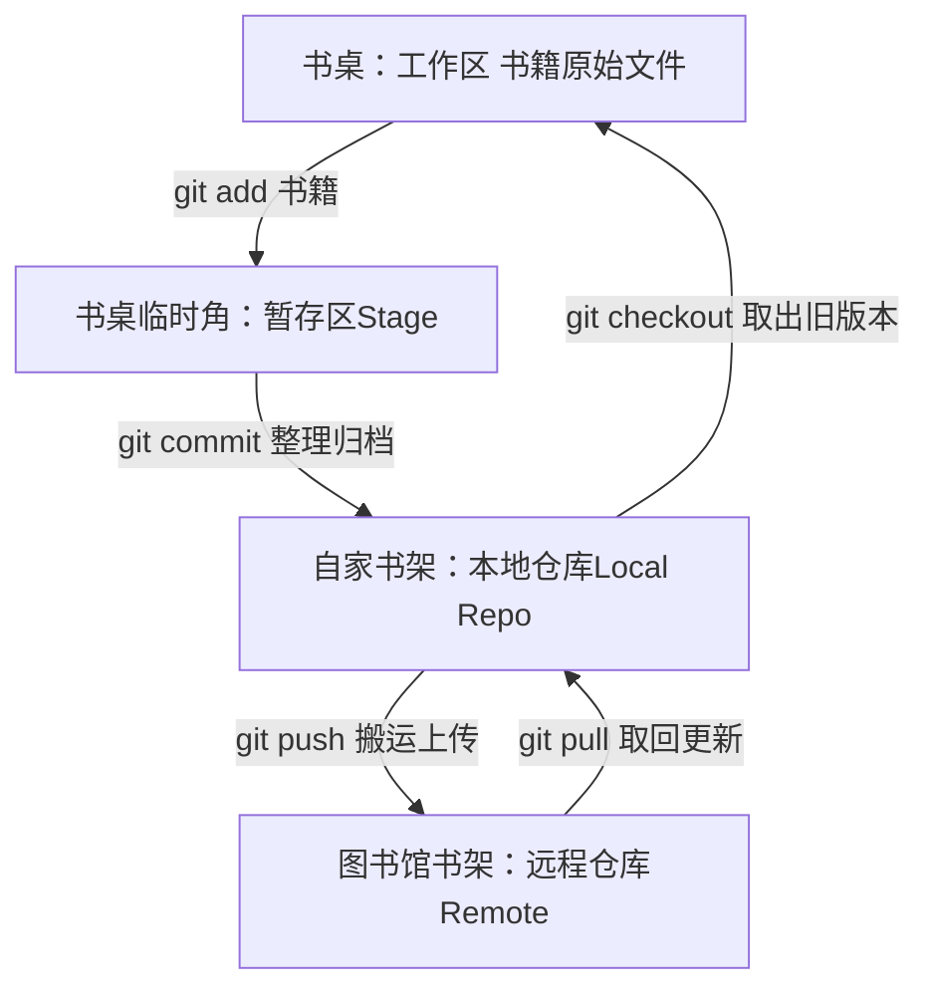

## Git操作一览


## git忽略文件 .gitignore
```git
HELP.md
target/
!.mvn/wrapper/maven-wrapper.jar
!**/src/main/**/target/
!**/src/test/**/target/

### STS ###
.apt_generated
.classpath
.factorypath
.project
.settings
.springBeans
.sts4-cache

### IntelliJ IDEA ###
.idea
*.iws
*.iml
*.ipr

### NetBeans ###
/nbproject/private/
/nbbuild/
/dist/
/nbdist/
/.nb-gradle/
build/
!**/src/main/**/build/
!**/src/test/**/build/

### VS Code ###
.vscode/

# Log file
*.log
/logs*

# BlueJ files
*.ctxt

# Mobile Tools for Java (J2ME)
.mtj.tmp/

# Package Files #
*.jar
*.war
*.ear
*.zip
*.tar.gz
*.rar
*.cmd
```

## 本地仓库
最强大的分布式版本控制系统，linus大牛

```plain
网址：https://www.liaoxuefeng.com/wiki/896043488029600/896827951938304
```

```plain
使用Windows的童鞋要特别注意：

千万不要使用Windows自带的**记事本**编辑任何文本文件。原因是Microsoft开发记事本的团队使用了一个非常弱智的行为来保存UTF-8编码的文件，他们自作聪明地在每个文件开头添加了0xefbbbf（十六进制）的字符，你会遇到很多不可思议的问题，比如，网页第一行可能会显示一个“?”，明明正确的程序一编译就报语法错误，等等，都是由记事本的弱智行为带来的。建议你下载[Visual Studio Code](https://code.visualstudio.com/)代替记事本，不但功能强大，而且免费！
```

因为Git是分布式版本控制系统，所以，每个机器都必须自报家门：你的名字和Email地址。你也许会担心，如果有人故意冒充别人怎么办？这个不必担心，首先我们相信大家都是善良无知的群众，其次，真的有冒充的也是有办法可查的。

```plain
git config --global user.name "liaozesheng"
git config --global user.email "liaozesheng@163.com"

git config --global -l       查看所有git config 配置
```



#### 1.git初始化
```plain
git init
初始化建立一个桌面
```

#### 2.添加书籍至书桌暂存区
```plain
git add git学习文档.md
git add .            可添加仓库中所有改动
```

#### 3.将暂存区的书籍整理到书架
```plain
git commit -m "wrote the first file"
```

#### 4.掌握书桌当前的状态
```plain
git status
```

#### 5.看具体修改了什么内容
```plain
git diff
```

#### 6.显示提交日志
```plain
git log
```

#### 7.回退版本
```plain
版本号没必要写全，前几位就可以了，Git会自动去找。当然也不能只写前一两位，因为Git可能会找到多个版本号，就无法确定是哪一个了。

git reset --hard commit_id
git reset --hard HEAD^
HEAD^ 代表上个版本
HEAD^^  代表上上个版本
HEAD^^^ 代表 上上上的版本
HEAD~100 代表上100个的那个版本
```

#### 8.回到未来
```plain
如果在过去想回到未来的版本
需要知道未来那个版本的commit_id
只要上面的命令行窗口还没有被关掉，你就可以顺着往上找啊找啊，找到未来你需要的那个commit_id
```

```plain
现在，你回退到了某个版本，关掉了电脑，第二天早上就后悔了，想恢复到新版本怎么办？找不到新版本的commit id怎么办？

在Git中，总是有后悔药可以吃的。当你用$ git reset --hard HEAD^回退到过去的版本时，再想恢复到未来版本，就必须找到未来版本的commit id。Git提供了一个命令git reflog用来记录你的每一次命令：
```

#### 9.记录每一次命令
```plain
git reflog      查看每次得到的commit_id是多少，可以回到未来的版本，即使关闭了对话框
```

#### 10.查看工作区和版本库
```plain
git diff HEAD --文件名
```

#### 11.git checkout -- file
```plain
将git 还未提交到暂存区的修改 直接还原到最近一次git commit或git add时的状态。使用git checkout -- file     世界直接清净了

命令git checkout -- 廖雪峰git学习文档.md 意思就是，把廖雪峰git学习文档.md文件在工作区的修改全部撤销，这里有两种情况：

一种是廖雪峰git学习文档.md自修改后还没有被放到暂存区，现在，撤销修改就回到和版本库一模一样的状态；

一种是廖雪峰git学习文档.md已经添加到暂存区后，又作了修改，现在，撤销修改就回到添加到暂存区后的状态。
```

#### 12.git reset HEAD file
```plain
上面 git checkout -- file 只能将git add 之前的修改操作进行回退
如果我们已经将不需要的修改 提交到了 暂存区，那么就需要使用git reset HEAD file 将file文件退回到工作区

git reset HEAD 廖雪峰git学习文档.md
退回到工作区之后，如果不需要此次修改，可以通过 git checkout -- 廖雪峰git学习文档.md 将文件修改还原
```

#### 13.删除文件
```plain
一般我们在工作区，将文件test.md右键菜单删除了
1.的确是需要删除这个文件test.md，那么需要我们也将版本库中的对应文件test.md删除
git rm test.md
使用commit 提交

2.这个文件test.md是我们误删的，我们需要将工作区的文件test.md恢复
可以将版本库中的test.md恢复到工作区
git checkout -- test.md
```

## 远程仓库
#### 1.创建SSH密钥
```plain
第1步：创建SSH Key。在用户主目录下，看看有没有.ssh目录，如果有，再看看这个目录下有没有id_rsa和id_rsa.pub这两个文件，如果已经有了，可直接跳到下一步。如果没有，打开Shell（Windows下打开Git Bash），创建SSH Key：

$ ssh-keygen -t rsa -C "liaozesheng@163.com"

你需要把邮件地址换成你自己的邮件地址，然后一路回车，使用默认值即可，由于这个Key也不是用于军事目的，所以也无需设置密码。

如果一切顺利的话，可以在用户主目录里找到.ssh目录，里面有id_rsa和id_rsa.pub两个文件，这两个就是SSH Key的秘钥对，id_rsa是私钥，不能泄露出去，id_rsa.pub是公钥，可以放心地告诉任何人。
```

#### 2.本地仓库推送远程仓库
```plain
可以把一个已有的本地仓库与之关联，然后，把本地仓库的内容推送到GitHub仓库。

git remote add origin https://gitee.com/liao-zesheng/git_study.git
git remote add origin git@gitee.com:liao-zesheng/git_study.git
git push -u origin main
远程库的名字就是origin，这是Git默认的叫法，也可以改成别的，但是origin这个名字一看就知道是远程库。
由于远程库是空的，我们第一次推送main分支时，加上了-u参数，Git不但会把本地的main分支内容推送的远程新的main分支，还会把本地的main分支和远程的main分支关联起来，在以后的推送或者拉取时就可以简化命令。
-u = --set-upstream  -u的意思就是把本地的main分支和远程的main分支关联起

从现在起，只要本地作了提交，就可以通过简化命令推送了
git push
```

```plain
 
```

#### 3.删除远程库
```plain
如果添加的时候地址写错了，或者就是想删除远程库，可以用git remote rm <name>命令。使用前，建议先用git remote -v查看远程库信息：
git remote -v

git remote remove origin
此处的“删除”其实是解除了本地和远程的绑定关系，并不是物理上删除了远程库。远程库本身并没有任何改动。要真正删除远程库，需要登录到GitHub，在后台页面找到删除按钮再删除。
```

#### 4.从远程库克隆
```plain
现有远程仓库，再创建本地仓库
git clone https://gitee.com/liao-zesheng/git_study.git
git clone git@gitee.com:liao-zesheng/git_study.git


我们勾选Initialize this repository with a README，这样GitHub会自动为我们创建一个README.md文件。创建完毕后，可以看到README.md文件：
```

## 分支管理
#### 1.创建和合并分支
```plain
HEAD严格来说不是指向提交，而是指向master，master才是指向提交的，所以，HEAD指向的就是当前分支。

首先，我们创建dev分支，然后切换到dev分支：
git checkout -b dev

git checkout命令加上-b参数表示创建并切换，相当于以下两条命令：
git branch dev
git checkout dev

查看分支
git branch

合并分支
比如现在 在master分支上
将dev分支上的内容合并到master分支
git merge dev

Fast-forward信息，Git告诉我们，这次合并是“快进模式”，也就是直接把master指向dev的当前提交，所以合并速度非常快。
当然，也不是每次合并都能Fast-forward，我们后面会讲其他方式的合并。

删除dev分支
git branch -d dev
```

#### 2.switch
```plain
我们注意到切换分支使用git checkout <branch>，而前面讲过的撤销修改则是git checkout -- <file>，同一个命令，有两种作用，确实有点令人迷惑。

实际上，切换分支这个动作，用switch更科学。因此，最新版本的Git提供了新的git switch命令来切换分支：

创建并切换到新的dev分支，可以使用：
git switch -c dev     更合理
git switch dev         切换到dev分支
```

#### 3.解决冲突
```plain
有冲突时，需要解决冲突，才能进行合并
Git用<<<<<<<，=======，>>>>>>>标记出不同分支的内容

解决 之后再进行
git add .
git commit -m "message"
git push origin main

我们可以使用
git log --graph --pretty=oneline --abbrev=commit  来查看分支的合并情况
```

## 日常问题合集
#### clone 仓库时，报错 <font style="color:rgb(51, 51, 51);">error: RPC failed; curl 18 transfer closed with outstanding read data remaining</font>
![[1725353103906-9971d60a-1ca5-4c42-991b-3bd1001a2c54.png]]

解决思路：

```shell
$ git config --global https.postBuffer 1073741824
$ git config --global https.postBuffer 1073741824
# 将这个数值往大了设置

git config --global http.lowSpeedLimit 0
git config --global http.lowSpeedTime 999999
```

#### 提交规范
1. 分支命名
    1. <font style="color:rgb(0, 0, 0);">日期_姓名首字母缩写_功能单词，如：</font>`<font style="color:rgb(19, 148, 216);">20240905_lzs_buildFramework</font>`
2. commit提交规范	
    1. 作者，type: desc，例如：廖泽胜，fix：修复查询用户信息逻辑问题

```shell
# 主要type
feat:     增加新功能
fix:      修复bug

# 特殊type
docs:     只改动了文档相关的内容
style:    不影响代码含义的改动，例如去掉空格、改变缩进、增删分号
build:    构造工具的或者外部依赖的改动，例如webpack，npm
refactor: 代码重构时使用
revert:   执行git revert打印的message

# 暂不使用type
test:     添加测试或者修改现有测试
perf:     提高性能的改动
ci:       与CI（持续集成服务）有关的改动
chore:    不修改src或者test的其余修改，例如构建过程或辅助工具的变动
```

#### <font style="color:rgb(34, 34, 38);">Couldn‘t connect to server</font>
解决使用git时遇到Failed to connect to github.com port 443 after 21090 ms: Couldn‘t connect to server

<font style="color:rgb(51, 51, 51);background-color:rgb(245, 246, 247);">如果是在挂着梯子的情况下拉取或者推送代码的时候是否遇到了报错，一般出现这种问题都是开过VPN导致的本机系统端口号和git的端口号不一致导致的。</font>

![[Pasted_image_20260730142712.png]]

![[Pasted_image_20260730142834.png]]

```sql
git config --global -l
git config --global http.proxy 127.0.0.1:10809
git config --global https.proxy 127.0.0.1:10809

git config --global --unset http.proxy
git config --global --unset https.proxy
```


#### git设置代理
我们日常开了全局系统代理可能发现对于git并不生效，git还是没有使用代理的地址去github上拉去项目，这是因为git的代理是git本身有设置项。

①设置全局代理

```bash
# 设置 HTTP 代理
git config --global http.proxy http://127.0.0.1:7890

# 设置 HTTPS 代理
git config --global https.proxy https://127.0.0.1:7890


# 设置 SOCKS 代理（同时支持 HTTP 和 HTTPS）
git config --global http.proxy socks5://127.0.0.1:7890
git config --global https.proxy socks5://127.0.0.1:7890
```

②设置局部代理

```bash
# 进入仓库目录
cd /path/to/your/repo

# 设置当前仓库的 HTTP 代理
git config http.proxy http://127.0.0.1:7890
git config https.proxy https://127.0.0.1:7890
```

③对某个网站设置代理，比如 github.com

```bash
# 对 github.com 使用代理
git config --global http."https://github.com".proxy http://127.0.0.1:7890
git config --global https."https://github.com".proxy https://127.0.0.1:7890

# 其他域名不使用代理（可选）
git config --global http."https://*.com".proxy ""
```

④取消代理

```bash
# 取消全局 HTTP/HTTPS 代理
git config --global --unset http.proxy
git config --global --unset https.proxy

# 取消特定域名的代理
git config --global --unset http."https://github.com".proxy
git config --global --unset https."https://github.com".proxy
```

⑤查看当前代理

```bash
git config --global --list
```


#### 解决每次pull输入认证信息
①使用windows的凭据管理器来解决

```bash
git config --global credential.helper wincred

git pull origin # 输入用户名和密码

# 之后凭据管理器就会将认证信息作为凭据收集
```


#### 忽略ssl证书，直接使用https
报错

```bash
$ git clone https://gitlab.ext-216.com/vcs/spring-petclinic.git
Cloning into 'spring-petclinic'...
fatal: unable to access 'https://gitlab.ext-216.com/vcs/spring-petclinic.git/': 
SSL certificate problem: unable to get local issuer certificate
```

自建的证书，git bash中不信任

```bash
# 对这个域名禁用 SSL 验证
git config --global http.https://gitlab.ext-216.com/.sslVerify false
```


#### 为什么显示一堆 \360\237… 八进制数字？中文乱码

核心原因：**Git 默认用八进制转义打印中文 / Emoji / 特殊字符文件名**
1. 你文件名里有：📐 Emoji、中文汉字、空格
2. Git 在终端输出时，为了兼容老式不支持 UTF-8 的终端，把非 ASCII 字符转成了八进制编码 `\xxx`
    
    比如：
    
    `📐LinuxLinux笔记/` → 被转义成了 `\360\237\214\263Linux...`

不是文件损坏，只是**显示编码问题** ，文件本身正常。

**永久修复：让 Git 直接显示中文，不转义**

修复命令
```bash
git config --global core.quotepath false
```

#### Git 取消跟踪目录、彻底移出仓库完整操作

1. 先在 `.gitignore` 加入忽略规则
2. 从 Git 索引中移除目录
```bash
git rm --cached -r 目录
```
`--cached`：只删除 Git 版本记录，**本地硬盘文件保留**
`-r`：递归删除整个文件夹所有子文件
3. 提交这次删除变更，推送到远程仓库
```bash
git add . 
git commit -m "remove dir xxx from git track" 
git push
```

#### Windows 默认换行符 CRLF告警
![[Pasted_image_20260731135541.png]]
Windows 默认换行符 **CRLF**（回车 + 换行），Linux/Mac 是 **LF**（仅换行）
Git 自动转换：提交时存 LF，拉到 Windows 自动转 CRLF，这条只是提示，不影响代码 / 笔记内容。

**永久关掉这个警告（Windows 推荐执行）**
```bash
# 让Git自动处理换行，不再弹窗警告 
git config --global core.autocrlf true 
# 关闭路径引号（之前中文文件名乱码一并解决） 
git config --global core.quotepath false
```