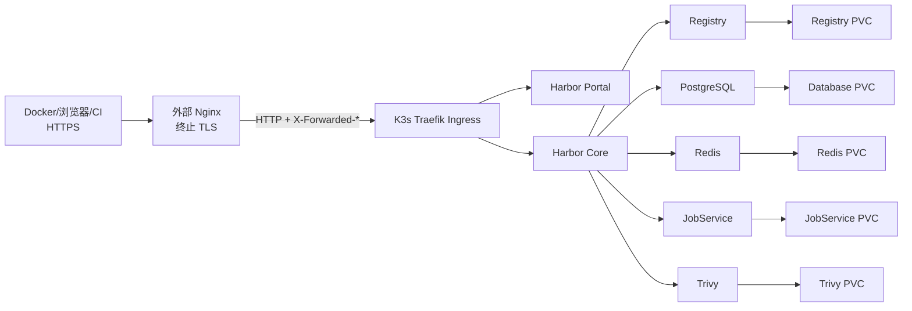

# Harbor 使用 Helm 安装部署

## 目标

在 K3s 集群中使用官方 Helm Chart 部署 Harbor，使用 Traefik Ingress 提供访问，并通过持久化卷保存 Registry、数据库、Redis、JobService 和 Trivy 数据。

本文同时记录 2026-06-23 将 Harbor 从 `default` Namespace 迁移到独立 `harbor` Namespace 的实际过程。

## 当前已验证基线

| 项目                    | 当前值                               |
| --------------------- | --------------------------------- |
| Kubernetes 发行版        | K3s `v1.35.4+k3s1`                |
| Helm 客户端              | Helm `v4.2.2`                     |
| Helm release          | `harbor`                          |
| Namespace             | `harbor`                          |
| Chart                 | `harbor/harbor` `1.19.1`          |
| Harbor                | `2.15.1`                          |
| IngressClass          | `traefik`                         |
| 域名                    | `registry.liaozesheng.cn`         |
| StorageClass          | `local-path`                      |
| 外部地址                  | `https://registry.liaozesheng.cn` |
| TLS 终止位置              | 集群外部 Nginx                        |
| Nginx 到 K3s           | HTTP，转发到 `k3s_ingress_http`       |
| Registry Location URL | `registry.relativeurls: true`     |
| 数据节点                  | `ext-215`                         |

当前组件：

| 组件 | 工作负载 | PVC |
|---|---|---|
| Core | Deployment | 无独立 PVC |
| Portal | Deployment | 无独立 PVC |
| Registry | Deployment | `harbor-registry`，5Gi |
| JobService | Deployment | `harbor-jobservice`，1Gi |
| PostgreSQL | StatefulSet | `database-data-harbor-database-0`，1Gi |
| Redis | StatefulSet | `data-harbor-redis-0`，1Gi |
| Trivy | StatefulSet | `data-harbor-trivy-0`，5Gi |

> [!warning]
> `local-path` PV 与具体节点绑定。当前 5 个 Harbor PV 都在 `ext-215`，这不是跨节点高可用存储。

## 架构



## 配置文件命名

统一使用：

| 文件 | 用途 |
|---|---|
| `values-reference.yaml` | 当前 Chart 版本的完整默认 values，只用于查阅和比较 |
| `values-custom.yaml` | 实际部署使用的自定义覆盖配置 |

不要直接修改完整默认 values，也不要把包含密码的 `values-custom.yaml` 提交到 Git。

## 部署前检查

```bash
kubectl get nodes -o wide
kubectl get storageclass
kubectl get ingressclass
kubectl -n kube-system get pods,svc | grep -i traefik
helm version
```

确认：

- 节点处于 `Ready`。
- `local-path` StorageClass 可用。
- Traefik 正常运行。
- 域名解析到可访问的 K3s/Traefik 地址。
- 节点磁盘、CPU 和内存满足 Harbor 运行需求。

## 获取 Chart

```bash
helm repo add harbor https://helm.goharbor.io
helm repo update harbor

helm pull harbor/harbor \
  --version 1.19.1

helm show values harbor/harbor \
  --version 1.19.1 > values-reference.yaml
```

检查 Chart：

```bash
helm show chart ./harbor-1.19.1.tgz
```

## Namespace 与管理员密码

创建 Namespace：

```bash
kubectl create namespace harbor \
  --dry-run=client -o yaml \
  | kubectl apply -f -
```

管理员密码不要直接写入笔记。可以使用 Chart 支持的 existing Secret：

```bash
read -rsp 'Harbor admin password: ' HARBOR_ADMIN_PASSWORD
echo

kubectl create secret generic harbor-admin-password \
  -n harbor \
  --from-literal=HARBOR_ADMIN_PASSWORD="$HARBOR_ADMIN_PASSWORD" \
  --dry-run=client -o yaml \
  | kubectl apply -f -

unset HARBOR_ADMIN_PASSWORD
```

对应 values：

```yaml
existingSecretAdminPassword: harbor-admin-password
existingSecretAdminPasswordKey: HARBOR_ADMIN_PASSWORD
```

> [!danger]
> Harbor 的管理员密码、数据库密码、Registry 凭据、内部 SecretKey、TLS 私钥和 htpasswd 都属于敏感信息，不应写入 Obsidian 或普通 Git 仓库。

## 新部署 values 示例

以下示例用于新的动态 PVC 部署。容量应按实际镜像规模调整。

```yaml
expose:
  type: ingress
  tls:
    enabled: false
  ingress:
    className: traefik
    hosts:
      core: registry.liaozesheng.cn

externalURL: https://registry.liaozesheng.cn

registry:
  # 外部 HTTPS、集群内部 HTTP 时必须返回相对 Location URL。
  relativeurls: true

existingSecretAdminPassword: harbor-admin-password
existingSecretAdminPasswordKey: HARBOR_ADMIN_PASSWORD

persistence:
  enabled: true
  resourcePolicy: keep
  persistentVolumeClaim:
    registry:
      storageClass: local-path
      accessMode: ReadWriteOnce
      size: 20Gi
    jobservice:
      jobLog:
        storageClass: local-path
        accessMode: ReadWriteOnce
        size: 1Gi
    database:
      storageClass: local-path
      accessMode: ReadWriteOnce
      size: 5Gi
    redis:
      storageClass: local-path
      accessMode: ReadWriteOnce
      size: 1Gi
    trivy:
      storageClass: local-path
      accessMode: ReadWriteOnce
      size: 5Gi

database:
  type: internal

redis:
  type: internal

trivy:
  enabled: true
```

> [!warning]
> 当前运行环境中 `externalURL` 是 HTTPS，但 Chart 内的 Ingress TLS 为关闭状态，说明 TLS 需要由集群外层或 Traefik 的其他配置负责。新环境不要照抄，必须确认实际 TLS 终止位置。

## 外部 Nginx TLS 与相对 URL

当前实际访问链路：

```text
Docker/浏览器
  → HTTPS registry.liaozesheng.cn:443
  → 外部 Nginx 终止 TLS
  → HTTP k3s_ingress_http
  → Traefik Ingress
  → Harbor
```

外部客户端使用 HTTPS，但 Nginx 到 K3s/Traefik 这一段使用 HTTP。在这种协议分层下必须设置：

```yaml
registry:
  relativeurls: true
```

启用后，Registry 在上传、下载和 Blob 跳转的 `Location` 响应头中返回相对 URL，由 Docker 客户端基于最初请求的 `https://registry.liaozesheng.cn` 解析。

如果保持默认值 `false`，Registry 可能根据内部 HTTP 请求生成绝对 URL，导致客户端在 pull/push 后续请求中跳转到错误的 HTTP 地址、内部地址或端口。

> [!important]
> 字段路径是 `registry.relativeurls`，全部小写且 `urls` 为复数。Harbor Chart `1.19.1` 的默认值是 `false`，当前环境必须显式覆盖为 `true`。

当前外部 Nginx 配置：

```nginx
# registry
server {
    listen 443 ssl;
    server_name registry.liaozesheng.cn;

    ssl_certificate /etc/nginx/certs/*.liaozesheng.cn.pem;
    ssl_certificate_key /etc/nginx/certs/*.liaozesheng.cn.key;

    location / {
        proxy_pass http://k3s_ingress_http;

        proxy_set_header Host $host;
        proxy_set_header X-Real-IP $remote_addr;
        proxy_set_header X-Forwarded-For $proxy_add_x_forwarded_for;
        proxy_set_header X-Forwarded-Proto $scheme;
        proxy_set_header X-Forwarded-Host $host;
        proxy_set_header X-Forwarded-Port $server_port;

        proxy_http_version 1.1;
        proxy_set_header Upgrade $http_upgrade;
        # proxy_set_header Connection "upgrade";

        proxy_set_header Authorization $http_authorization;
        proxy_pass_header Authorization;

        # 禁用缓冲，支持大镜像推送。
        proxy_buffering off;
        proxy_request_buffering off;
        client_max_body_size 0;
        proxy_read_timeout 900s;
        proxy_send_timeout 900s;
    }
}
```

关键点：

- `Host` 必须保留外部域名。
- `X-Forwarded-Proto` 必须传递原始 HTTPS 协议。
- `X-Forwarded-Host` 和 `X-Forwarded-Port` 用于保持外部访问上下文。
- `Authorization` 请求头必须向后转发。
- 必须关闭请求缓冲，否则大镜像 push 可能失败或占满 Nginx 临时目录。
- `client_max_body_size 0` 避免限制镜像层大小。
- 长超时用于大镜像上传和下载。

检查 live Helm values：

```bash
helm get values harbor -n harbor -o yaml \
  | grep -A2 '^registry:'
```

检查 Registry 容器内最终配置：

```bash
kubectl -n harbor exec deployment/harbor-registry \
  -c registry -- \
  grep -n 'relativeurls' /etc/registry/config.yml
```

当前已验证输出：

```text
relativeurls: true
```

## 当前迁移后 PVC 配置

迁移后的 release 显式使用原 PV 对应的 existing PVC：

```yaml
persistence:
  enabled: true
  resourcePolicy: keep
  persistentVolumeClaim:
    registry:
      existingClaim: harbor-registry
    jobservice:
      jobLog:
        existingClaim: harbor-jobservice
    database:
      existingClaim: database-data-harbor-database-0
    redis:
      existingClaim: data-harbor-redis-0
    trivy:
      existingClaim: data-harbor-trivy-0
```

> [!important]
> 迁移后升级 Harbor 时必须保留这 5 个 `existingClaim`。丢失这些配置可能导致 Chart 创建新的空 PVC，使 Harbor 看起来像“数据丢失”。

## 部署前渲染检查

```bash
helm lint ./harbor-1.19.1.tgz \
  -f values-custom.yaml

helm template harbor ./harbor-1.19.1.tgz \
  -n harbor \
  -f values-custom.yaml > harbor-rendered.yaml

kubectl apply --dry-run=server \
  -f harbor-rendered.yaml
```

检查关键资源：

```bash
grep -nE 'kind: (Ingress|PersistentVolumeClaim|Deployment|StatefulSet)|claimName:|storageClassName:' \
  harbor-rendered.yaml
```

## 安装

```bash
helm upgrade --install harbor ./harbor-1.19.1.tgz \
  -n harbor \
  --create-namespace \
  -f values-custom.yaml \
  --wait \
  --timeout 15m
```

查看 release：

```bash
helm list -n harbor
helm status harbor -n harbor
helm history harbor -n harbor
```

## 部署验证

### 工作负载

```bash
kubectl -n harbor get pods -o wide
kubectl -n harbor get deploy,statefulset,svc,ingress,pvc
kubectl -n harbor get events \
  --sort-by=.metadata.creationTimestamp | tail -50
```

预期组件：

```text
harbor-core
harbor-database
harbor-jobservice
harbor-portal
harbor-redis
harbor-registry
harbor-trivy
```

### Core API

```bash
kubectl -n harbor exec deployment/harbor-core -- \
  curl -fsS http://127.0.0.1:8080/api/v2.0/ping
```

预期：

```text
Pong
```

### 外部访问

```bash
curl -I https://registry.liaozesheng.cn
curl -sS https://registry.liaozesheng.cn/api/v2.0/ping
```

检查 Registry V2 接口：

```bash
curl -skI https://registry.liaozesheng.cn/v2/
```

未登录时通常返回 `401 Unauthorized`，这说明 HTTPS、Nginx、Traefik 和 Registry 路由已经连通；如果返回 404、502 或跳转到 HTTP，应重点检查 Host、`X-Forwarded-Proto` 和 `registry.relativeurls`。

### 数据和制品数量

```bash
kubectl -n harbor exec harbor-database-0 -- sh -c '
  PGPASSWORD="$POSTGRES_PASSWORD" \
  psql -U postgres -d registry -Atc "
    select ''projects=''||count(*) from project;
    select ''repositories=''||count(*) from repository;
    select ''artifacts=''||count(*) from artifact;
  "
'
```

2026-06-23 迁移前后验证结果：

```text
projects=4
repositories=18
artifacts=18
```

Registry 数据量：

```bash
kubectl -n harbor exec deployment/harbor-registry \
  -c registry -- du -sh /storage
```

迁移后约为：

```text
2.7G /storage
```

## 客户端使用

登录：

```bash
docker login registry.liaozesheng.cn
```

推送镜像：

```bash
docker tag redis:latest \
  registry.liaozesheng.cn/bitnami/redis:latest

docker push \
  registry.liaozesheng.cn/bitnami/redis:latest
```

拉取镜像：

```bash
docker pull \
  registry.liaozesheng.cn/bitnami/redis:latest
```

Kubernetes 使用 Harbor Secret：

```bash
kubectl create secret docker-registry harbor-secret \
  -n <业务Namespace> \
  --docker-server=registry.liaozesheng.cn \
  --docker-username='<用户名>' \
  --docker-password='<密码>'
```

Deployment 中引用：

```yaml
spec:
  template:
    spec:
      imagePullSecrets:
        - name: harbor-secret
```

## 备份

### 备份 Helm 配置

```bash
BACKUP_DIR="harbor-backup-$(date +%Y%m%d-%H%M%S)"
mkdir -p "$BACKUP_DIR"

helm get values harbor -n harbor -o yaml \
  > "$BACKUP_DIR/values-custom.yaml"

helm show values harbor/harbor --version 1.19.1 \
  > "$BACKUP_DIR/values-reference.yaml"

helm get manifest harbor -n harbor \
  > "$BACKUP_DIR/manifest-current.yaml"
```

### 备份 Secret

```bash
kubectl -n harbor get secret \
  harbor-core \
  harbor-database \
  harbor-jobservice \
  harbor-registry \
  harbor-registry-htpasswd \
  harbor-registryctl \
  harbor-trivy \
  -o yaml > "$BACKUP_DIR/secrets-current.yaml"
```

> [!danger]
> `secrets-current.yaml` 包含真实认证材料，必须加密保存或严格限制文件权限。

### PostgreSQL 逻辑备份

```bash
kubectl -n harbor exec harbor-database-0 -- sh -c '
  PGPASSWORD="$POSTGRES_PASSWORD" \
  pg_dumpall -U postgres
' > "$BACKUP_DIR/harbor-database-pgdumpall.sql"
```

### PVC 冷备份

Harbor 停写并停止所有组件后，再对以下数据做存储快照或文件级备份：

```text
harbor-registry
harbor-jobservice
database-data-harbor-database-0
data-harbor-redis-0
data-harbor-trivy-0
```

> [!warning]
> 不要在 Registry 和数据库持续写入时直接复制 `local-path` 目录并把它当作一致性备份。

## 2026-06-23 Namespace 迁移记录

### 迁移目标

将 Helm release `harbor` 从 `default` Namespace 迁移到独立的 `harbor` Namespace，保持域名、Chart 版本、Harbor 版本、内部 Secret 和已有镜像不变。

### 迁移前状态

```text
Namespace: default
Chart: harbor-1.19.1
Harbor: 2.15.1
Registry: 2.7G
Projects: 4
Repositories: 18
Artifacts: 18
```

5 个 PV 初始回收策略都是 `Delete`。虽然 values 中设置了：

```yaml
persistence:
  resourcePolicy: keep
```

但这不等于 PV 的 `persistentVolumeReclaimPolicy` 一定是 `Retain`。

### 第一步：保护 PV

```bash
kubectl patch pv <pv-name> \
  --type merge \
  -p '{"spec":{"persistentVolumeReclaimPolicy":"Retain"}}'
```

必须逐个确认：

```bash
kubectl get pv \
  -o custom-columns='NAME:.metadata.name,STATUS:.status.phase,RECLAIM:.spec.persistentVolumeReclaimPolicy,CLAIM_NS:.spec.claimRef.namespace,CLAIM:.spec.claimRef.name'
```

### 第二步：停止 Harbor

先停止对外写入组件：

```bash
kubectl -n default scale deployment \
  harbor-core \
  harbor-jobservice \
  harbor-portal \
  harbor-registry \
  --replicas=0
```

再停止有状态组件：

```bash
kubectl -n default scale statefulset \
  harbor-trivy \
  harbor-redis \
  harbor-database \
  --replicas=0
```

确认 Harbor Pod 全部退出后，再生成冷备份。

### 第三步：卸载旧 release

```bash
helm uninstall harbor \
  -n default \
  --keep-history \
  --wait \
  --timeout 10m
```

确认 PV 是 `Retain` 后，才能删除旧 Namespace 下的 PVC。

### 第四步：重新绑定 PV

旧 PVC 删除后，PV 会进入 `Released`：

```bash
kubectl patch pv <pv-name> \
  --type merge \
  -p '{"spec":{"claimRef":null}}'
```

PV 进入 `Available` 后，在 `harbor` Namespace 创建同名 PVC，并通过 `volumeName` 指向原 PV：

```yaml
apiVersion: v1
kind: PersistentVolumeClaim
metadata:
  name: harbor-registry
  namespace: harbor
spec:
  accessModes:
    - ReadWriteOnce
  storageClassName: local-path
  volumeName: <原Registry-PV名称>
  resources:
    requests:
      storage: 5Gi
```

其他 4 个 PVC 按相同方法处理。

### 第五步：安装新 release

`values-custom.yaml` 中必须设置 5 个 `existingClaim`，然后安装：

```bash
helm install harbor ./harbor-1.19.1.tgz \
  -n harbor \
  -f values-custom.yaml \
  --wait \
  --timeout 15m
```

### Helm 4 Secret 字段冲突

预复制 Harbor 内部 Secret 后，Helm 4 Server-Side Apply 出现：

```text
conflicts with "kubectl-client-side-apply"
```

冲突字段：

```text
harbor-core: tls.crt
harbor-core: tls.key
harbor-registry-htpasswd: REGISTRY_HTPASSWD
```

处理方法：

1. 迁移前计算每个 Secret 的哈希。
2. 使用 `--force-conflicts --take-ownership` 让 Helm 接管字段。
3. 从迁移前备份恢复上述 3 个字段。
4. 滚动重启 Core、Registry 和 JobService。
5. 再次比较完整 Secret 哈希。

```bash
helm upgrade harbor ./harbor-1.19.1.tgz \
  -n harbor \
  -f values-custom.yaml \
  --force-conflicts \
  --take-ownership \
  --wait \
  --timeout 15m
```

> [!danger]
> 不要在没有 Secret 备份和哈希保护的情况下盲目使用 `--force-conflicts`。Registry htpasswd 与 Core 中的 Registry 凭据不一致时，会导致 Harbor 内部认证失败。

### 迁移验证结果

```text
Helm release: deployed
Namespace: harbor
7 个 Harbor Pod: Ready
5 个原 PV: Bound + Retain
Secret 哈希: 全部一致
Projects: 4
Repositories: 18
Artifacts: 18
Registry 数据: 2.7G
Core API: Pong
外部 API: HTTP 200
真实镜像拉取: 成功
default 中 Harbor 工作负载: 0
```

真实拉取验证使用：

```text
registry.liaozesheng.cn/bitnami/redis:latest
```

测试 Pod 使用 `imagePullPolicy: Always`，并在 `ext-214` 上成功从迁移后的 Harbor 拉取镜像。

## 升级

升级前：

```bash
helm history harbor -n harbor
helm get values harbor -n harbor -o yaml > values-custom.yaml
kubectl -n harbor get pod,pvc,ingress -o wide
```

升级要求：

1. 备份数据库、Registry 和 Secret。
2. 阅读 Harbor 与 Chart 的升级说明。
3. 保留 5 个 `existingClaim`。
4. 使用新版本 `values-reference.yaml` 对比字段变化。
5. 执行 `helm lint` 和 `helm template`。
6. 在维护窗口执行升级。

```bash
helm upgrade harbor ./harbor-<目标Chart版本>.tgz \
  -n harbor \
  -f values-custom.yaml \
  --wait \
  --timeout 15m
```

## 回滚

```bash
helm history harbor -n harbor

helm rollback harbor <revision> \
  -n harbor \
  --wait \
  --timeout 15m
```

> [!danger]
> Helm 回滚只能回滚 Kubernetes 资源，不能自动恢复 PostgreSQL、Registry Blob 或 Redis 数据。

Namespace/PV 迁移失败时，应优先：

1. 停止新 Namespace 中的 Harbor。
2. 保留所有 PV 和 PVC。
3. 根据冷备份恢复数据目录。
4. 将 PV claimRef 重新绑定到旧 Namespace。
5. 使用旧 Helm history 恢复原 release。

## 卸载

```bash
helm uninstall harbor -n harbor
kubectl -n harbor get pvc
kubectl get pv
```

确认备份可恢复之前，不要删除 PVC、PV 或 `local-path` 底层目录。

## 常见问题

| 问题 | 排查方向 | 处理方法 |
|---|---|---|
| Pod `Pending` | PVC、PV、节点亲和性 | 检查 PV 是否绑定 `ext-215`，PVC 是否 `Bound` |
| Registry 数据为空 | Chart 创建了新 PVC | 检查 `existingClaim` 和实际 `claimName` |
| Core 无法访问 Registry | htpasswd 与内部密码不一致 | 恢复原 Secret，比较哈希并滚动重启 |
| Helm 4 SSA 冲突 | 资源由 `kubectl-client-side-apply` 管理 | 备份 Secret 后谨慎使用 `--force-conflicts --take-ownership` |
| Ingress 404 | Host、IngressClass、DNS | 检查 `registry.liaozesheng.cn` 和 `traefik` |
| HTTPS 失败 | Chart TLS 与外部 TLS 终止不一致 | 明确证书由 Chart、Traefik 还是外层代理管理 |
| pull/push 跳转到 HTTP 或内部地址 | 外部 HTTPS、内部 HTTP，Registry 返回绝对 URL | 设置 `registry.relativeurls: true` 并检查 `X-Forwarded-*` 请求头 |
| 大镜像 push 失败或超时 | Nginx 请求缓冲、Body 限制或超时过短 | 关闭请求缓冲，设置 `client_max_body_size 0` 和足够的读写超时 |
| ImagePullBackOff | Harbor 不可用、凭据错误 | 检查 Harbor API、`imagePullSecrets` 和节点 registry 配置 |
| 卸载后 PV 被删除 | ReclaimPolicy 为 `Delete` | 迁移/卸载前先改为 `Retain` |
| Harbor 停机后无法拉工具镜像 | 节点将 Docker Hub 代理到 Harbor | 提前准备节点已缓存的备份工具镜像并使用 `imagePullPolicy: Never` |

## 快速排查命令

```bash
helm status harbor -n harbor
helm history harbor -n harbor
helm get values harbor -n harbor -o yaml

kubectl -n harbor get pods -o wide
kubectl -n harbor get deploy,statefulset,svc,ingress,pvc
kubectl -n harbor get events --sort-by=.metadata.creationTimestamp

kubectl -n harbor logs deployment/harbor-core --tail=200
kubectl -n harbor logs deployment/harbor-registry -c registry --tail=200
kubectl -n harbor logs deployment/harbor-jobservice --tail=200

kubectl get pv \
  -o custom-columns='NAME:.metadata.name,STATUS:.status.phase,RECLAIM:.spec.persistentVolumeReclaimPolicy,CLAIM_NS:.spec.claimRef.namespace,CLAIM:.spec.claimRef.name'
```

## 相关笔记

- [[技术栈索引]]
- [[Nexus3_使用helm安装部署]]
- [[Redis_使用_Helm_单机部署]]
- [[Kubernetes_Pod_Pending_排查]]
- [[Kubernetes_Pod_CrashLoopBackOff_排查]]
- [[Kubernetes_PV_挂载失败排查]]
- [[Kubernetes_Ingress_路由失效排查]]
- [[Kubernetes_Service_无响应排查]]

## 外部参考

- [Harbor Helm Chart](https://github.com/goharbor/harbor-helm)
- [Harbor 官方文档](https://goharbor.io/docs/)
