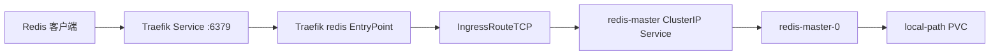

# Redis 使用 Helm 单机部署

## 目标

在 K3s 集群中使用 Bitnami Redis Helm Chart 部署单机 Redis，启用密码认证和持久化，并根据需要通过 Traefik TCP EntryPoint 对外提供访问。

## 已验证部署基线

| 项目 | 当前值 |
|---|---|
| Kubernetes 发行版 | K3s |
| Helm Chart | Bitnami Redis |
| Chart 版本 | `27.0.4` |
| 部署模式 | `standalone` |
| 副本 | 不启用 |
| Release | `redis` |
| Namespace | `redis` |
| 内部端口 | `6379/TCP` |
| StorageClass | `local-path` |
| 外部入口 | Traefik TCP EntryPoint `redis` |

> [!note]
> `architecture: standalone` 是 Bitnami Redis Chart 支持的正式模式。私有镜像仓库触发的镜像校验错误与单机模式无关。

## 访问链路



集群内部应用不需要经过 Traefik，可以直接连接：

```text
redis-master.redis.svc.cluster.local:6379
```

## 部署前检查

```bash
kubectl get nodes -o wide
kubectl get storageclass
kubectl get ingressclass
helm version
```

确认：

- K3s 节点处于 `Ready`。
- `local-path` StorageClass 可用。
- 如果需要集群外访问，Traefik 正常运行。
- 节点具备足够的内存和持久化磁盘空间。

## 下载 Chart

固定使用已经验证的 Chart 版本：

```bash
export REDIS_CHART_VERSION=27.0.4

helm pull \
  oci://registry-1.docker.io/bitnamicharts/redis \
  --version "$REDIS_CHART_VERSION"
```

检查 Chart 信息和默认 values：

```bash
helm show chart ./redis-27.0.4.tgz
helm show values ./redis-27.0.4.tgz > values-reference.yaml
```

不要直接长期维护完整的默认 values。建议单独创建精简的 `values-custom.yaml`，只保存实际覆盖项。

## 创建密码 Secret

幂等创建 Namespace：

```bash
kubectl create namespace redis \
  --dry-run=client -o yaml \
  | kubectl apply -f -
```

交互式创建密码 Secret，避免密码直接写入 values 或命令历史：

```bash
read -rsp 'Redis password: ' REDIS_PASSWORD
echo

kubectl create secret generic redis-auth \
  -n redis \
  --from-literal=redis-password="$REDIS_PASSWORD" \
  --dry-run=client -o yaml \
  | kubectl apply -f -

unset REDIS_PASSWORD
```

检查 Secret，但不要输出密码：

```bash
kubectl -n redis get secret redis-auth
```

## 单机 values 配置

创建 `values-custom.yaml`：

```yaml
global:
  imageRegistry: registry.liaozesheng.cn
  defaultStorageClass: local-path
  security:
    # 私库中的镜像是官方 Bitnami 镜像的可信同步版本时才开启。
    allowInsecureImages: true

architecture: standalone

image:
  repository: bitnami/redis
  # 应替换为实际验证过的固定标签或 digest，避免长期使用 latest。
  tag: latest
  pullPolicy: IfNotPresent

auth:
  enabled: true
  existingSecret: redis-auth
  existingSecretPasswordKey: redis-password
  usePasswordFiles: true

commonConfiguration: |-
  appendonly yes
  appendfsync everysec

master:
  persistence:
    enabled: true
    storageClass: local-path
    accessModes:
      - ReadWriteOnce
    size: 8Gi

  persistentVolumeClaimRetentionPolicy:
    enabled: true
    whenScaled: Retain
    whenDeleted: Retain

  resourcesPreset: none
  resources:
    requests:
      cpu: 100m
      memory: 256Mi
    limits:
      cpu: 500m
      memory: 512Mi

  startupProbe:
    enabled: true
    periodSeconds: 5
    timeoutSeconds: 5
    failureThreshold: 30

  service:
    type: ClusterIP
    ports:
      redis: 6379

networkPolicy:
  enabled: true
  # Traefik 位于其他 Namespace 时，先允许其访问 Redis Service。
  allowExternal: true

metrics:
  enabled: false

tls:
  enabled: false

volumePermissions:
  enabled: false
```

### 关于 Redis 模块

如果 values 中包含：

```yaml
commonConfiguration: |-
  loadmodule /opt/bitnami/redis/lib/redis/modules/redisearch.so
  loadmodule /opt/bitnami/redis/lib/redis/modules/rejson.so
```

必须先确认实际镜像中存在这两个文件：

```bash
kubectl -n redis exec redis-master-0 -- \
  ls -l /opt/bitnami/redis/lib/redis/modules/
```

如果镜像不包含模块，Redis 会因 `loadmodule` 失败而无法启动。普通缓存场景不需要时，直接删除这两个配置项。

### 关于私有镜像校验

当镜像被同步到私有仓库后，Chart 可能报错：

```text
Original containers have been substituted for unrecognized ones
```

这是 Bitnami Chart 的镜像来源校验，不代表 `standalone` 模式不受支持。确认私库镜像可信后使用：

```yaml
global:
  security:
    allowInsecureImages: true
```

> [!warning]
> `allowInsecureImages` 只是跳过 Chart 的镜像来源验证，并不表示允许匿名仓库或明文网络传输。

## 部署前渲染检查

```bash
helm lint ./redis-27.0.4.tgz -f values-custom.yaml

helm template redis ./redis-27.0.4.tgz \
  -n redis \
  -f values-custom.yaml > redis-rendered.yaml
```

检查实际镜像、架构、Service 和 PVC：

```bash
grep -nE 'image:|kind: StatefulSet|kind: Service|kind: PersistentVolumeClaim|storageClassName:' \
  redis-rendered.yaml
```

确认没有生成 Redis replica StatefulSet：

```bash
grep -n 'redis-replicas' redis-rendered.yaml || true
```

## 安装 Redis

```bash
helm upgrade --install redis ./redis-27.0.4.tgz \
  -n redis \
  --create-namespace \
  -f values-custom.yaml \
  --wait \
  --timeout 10m
```

检查 Helm 状态：

```bash
helm list -n redis
helm status redis -n redis
helm history redis -n redis
```

## 集群内部验证

检查资源：

```bash
kubectl -n redis get pod,svc,pvc -o wide
kubectl -n redis get events --sort-by=.metadata.creationTimestamp | tail -50
```

读取密码到临时变量：

```bash
REDIS_PASSWORD="$(kubectl -n redis get secret redis-auth \
  -o jsonpath='{.data.redis-password}' | base64 -d)"
```

执行连通性测试：

```bash
kubectl -n redis exec redis-master-0 -- \
  redis-cli --no-auth-warning -a "$REDIS_PASSWORD" PING
```

预期返回：

```text
PONG
```

检查读写：

```bash
kubectl -n redis exec redis-master-0 -- \
  redis-cli --no-auth-warning -a "$REDIS_PASSWORD" SET deploy-check ok

kubectl -n redis exec redis-master-0 -- \
  redis-cli --no-auth-warning -a "$REDIS_PASSWORD" GET deploy-check

unset REDIS_PASSWORD
```

## 持久化验证

确认 PVC 已绑定：

```bash
kubectl -n redis get pvc
kubectl -n redis describe pvc
```

写入测试值后删除 Pod：

```bash
kubectl -n redis delete pod redis-master-0
kubectl -n redis wait --for=condition=Ready pod/redis-master-0 --timeout=5m
```

Pod 恢复后再次读取 `deploy-check`。能够返回 `ok`，说明 PVC 挂载和 AOF 恢复路径正常。

> [!warning]
> Pod 重建验证不能替代正式备份。`local-path` 通常绑定具体节点，节点磁盘损坏时 PVC 也可能丢失。

## 通过 Traefik 暴露 TCP 端口

### 配置 Traefik EntryPoint

K3s Server 的 manifests 目录中保存 Traefik 的 `HelmChartConfig`：

```yaml
apiVersion: helm.cattle.io/v1
kind: HelmChartConfig
metadata:
  name: traefik
  namespace: kube-system
spec:
  valuesContent: |-
    ports:
      redis:
        port: 6379
        expose:
          default: true
```

这个配置只负责让 Traefik 监听并暴露 `6379`，不会自动把流量转发给 Redis。

### 创建 IngressRouteTCP

确认 Service 名称：

```bash
kubectl -n redis get svc
```

创建 `redis-ingress-route-tcp.yaml`：

```yaml
apiVersion: traefik.io/v1alpha1
kind: IngressRouteTCP
metadata:
  name: redis
  namespace: redis
spec:
  entryPoints:
    - redis
  routes:
    - match: HostSNI(`*`)
      services:
        - name: redis-master
          port: 6379
```

应用并检查：

```bash
kubectl apply -f redis-ingress-route-tcp.yaml
kubectl -n redis get ingressroutetcp
kubectl -n kube-system get svc traefik
```

外部验证：

```bash
redis-cli -h <K3s节点IP或Traefik外部IP> \
  -p 6379 \
  -a '<Redis密码>' \
  PING
```

> [!danger]
> 不要将 Redis `6379` 无限制暴露到公网。至少应使用强密码并在防火墙或安全组中限制来源 IP；更推荐通过内网、VPN 或 WireGuard 访问。

## 备份与恢复

触发一次后台快照：

```bash
REDIS_PASSWORD="$(kubectl -n redis get secret redis-auth \
  -o jsonpath='{.data.redis-password}' | base64 -d)"

kubectl -n redis exec redis-master-0 -- \
  redis-cli --no-auth-warning -a "$REDIS_PASSWORD" BGSAVE

kubectl -n redis exec redis-master-0 -- \
  redis-cli --no-auth-warning -a "$REDIS_PASSWORD" LASTSAVE

unset REDIS_PASSWORD
```

正式备份还应包含：

- Redis AOF/RDB 数据。
- PVC 或底层存储快照。
- `values-custom.yaml`。
- `redis-auth` Secret 的安全备份。
- Traefik EntryPoint 和 `IngressRouteTCP` 配置。

恢复操作必须在隔离环境验证，至少检查 Redis 能否启动、密码是否匹配以及关键业务数据是否可读。

## 升级与回滚

升级前记录并备份：

```bash
helm history redis -n redis
helm get values redis -n redis -a > values-current.yaml
kubectl -n redis get pod,pvc -o wide
```

升级时固定新 Chart 版本，并重新执行 `helm lint` 和 `helm template`：

```bash
helm upgrade redis ./redis-<目标Chart版本>.tgz \
  -n redis \
  -f values-custom.yaml \
  --wait \
  --timeout 10m
```

回滚：

```bash
helm history redis -n redis

helm rollback redis <revision> \
  -n redis \
  --wait \
  --timeout 10m
```

> [!danger]
> Helm 回滚只恢复 Kubernetes 资源，不会自动还原 Redis 数据。升级镜像前必须确认 Redis 数据格式和持久化文件兼容性。

## 卸载

```bash
helm uninstall redis -n redis
kubectl -n redis get pvc
```

卸载后检查 PVC 是否保留。确认备份可恢复之前，不要手动删除 PVC、PV 或 K3s `local-path` 底层目录。

## 常见问题

| 问题 | 排查方向 | 处理方法 |
|---|---|---|
| `Original containers have been substituted` | 使用私有镜像仓库 | 确认镜像可信后设置 `global.security.allowInsecureImages: true` |
| Pod `CrashLoopBackOff` | 模块路径、AOF、权限、内存 | 查看 current/previous 日志，确认 `loadmodule` 文件存在 |
| Pod `Pending` | PVC、StorageClass、节点容量 | 检查 PVC、PV 和 `local-path` 节点绑定 |
| `NOAUTH Authentication required` | 客户端未携带密码 | 从 Secret 获取密码并使用 `redis-cli -a` |
| 集群内无法连接 | Service、Endpoint、NetworkPolicy | 检查 `redis-master` Service 和 EndpointSlice |
| 外部 6379 无响应 | Traefik 端口或 TCP 路由缺失 | 同时检查 HelmChartConfig 和 `IngressRouteTCP` |
| Traefik Helm Job 失败 | `expose` 类型错误 | 使用 `expose.default: true`，参考相关故障复盘 |
| Pod 重建后数据丢失 | PVC 未挂载或持久化关闭 | 检查 `master.persistence` 和实际挂载目录 |

## 快速排查命令

```bash
helm status redis -n redis
helm get values redis -n redis -a
kubectl -n redis get pod,svc,pvc -o wide
kubectl -n redis describe pod redis-master-0
kubectl -n redis logs redis-master-0 --tail=200
kubectl -n redis logs redis-master-0 --previous --tail=200
kubectl -n redis get events --sort-by=.metadata.creationTimestamp | tail -50
kubectl -n redis get endpoints,endpointslices
kubectl -n redis get ingressroutetcp
kubectl -n kube-system get svc traefik
```

## 相关笔记

- [[技术栈索引]]
- [[HelmChartConfig类型错误导致helm-install-traefikCrashLoopBackOff]]
- [[Kubernetes_Pod_CrashLoopBackOff_排查]]
- [[Kubernetes_PV_挂载失败排查]]
- [[Kubernetes_Service_无响应排查]]
- [[Docker_微服务密钥与缓存优化]]
