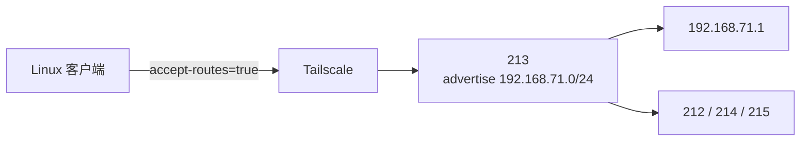

# Tailscale 日常使用与子网路由排障

本文用于 Tailscale 日常状态检查、节点连通性验证和 Linux 子网路由排障。当前已记录的实际网络拓扑见 [[个人局域网环境#Tailscale 私有网络]]。

## 核心概念

| 功能 | 含义 | Linux 关键选项 |
|---|---|---|
| Tailscale 节点 | 通过 `100.x.y.z` 地址直接访问另一台已入网设备 | 无需子网路由 |
| 子网路由器 | 代理访问未安装 Tailscale 的局域网设备 | `--advertise-routes` |
| 子网路由客户端 | 接受并使用其他节点发布的子网路由 | `--accept-routes` |
| Exit Node | 将默认互联网流量交给指定 Tailscale 节点 | `--advertise-exit-node`、`--exit-node` |

> [!important] 发布路由不等于客户端已经使用路由
> 子网路由需要同时经过“路由器发布 → Tailnet 批准 → 客户端接受”三个阶段。其中任何一步缺失，访问端的数据包都不会进入子网路由器。

## 当前环境

| 节点 | Tailscale IP | 角色 |
|---|---|---|
| `213` / `ext-213` | `100.100.71.213` | 子网路由器，发布 `192.168.71.0/24` |
| `18` / `racknerd-feaf32b` | `100.100.71.18` | 普通 Tailscale 节点，当前不接受子网路由 |



## 日常检查命令

### 查看节点状态

```bash
tailscale status
tailscale ip -4
```

`tailscale status` 用于查看本机是否已连接 Tailnet、其他节点是否在线以及当前连接类型。

### 验证 Tailscale 节点连通性

```bash
tailscale ping 100.100.71.213
tailscale ping 100.100.71.18
```

`tailscale ping` 只验证 Tailnet 节点间连通性。它成功不代表客户端已接受 `192.168.71.0/24` 子网路由。

### 查看客户端是否接受路由

```bash
tailscale debug prefs | grep -E 'RouteAll|WantRunning'
ip route show table 52
ip route get 192.168.71.1
```

判断要点：

- `RouteAll: true` 表示客户端允许接受发布的路由。
- Tailscale 在 Linux 上通过策略路由工作，相关路由通常位于路由表 `52`。
- 如果 `192.168.71.0/24` 不在表 `52` 中，数据包通常不会走 `tailscale0`。

## 配置子网路由

### 路由器端

Linux 子网路由器首先需要开启 IP 转发，然后发布目标网段：

```bash
sysctl net.ipv4.ip_forward
sudo tailscale set --advertise-routes=192.168.71.0/24
```

发布后还需要在 Tailscale 管理控制台批准该路由，或使用 tailnet policy 的 `autoApprovers` 自动批准。

### Linux 客户端

Linux 默认不使用已发布的子网路由。需要访问远程局域网时执行：

```bash
sudo tailscale set --accept-routes=true
```

如果不希望该 Linux 节点使用任何子网路由：

```bash
sudo tailscale set --accept-routes=false
```

> [!note]
> `--accept-routes=true` 只会让本机使用其他节点提供的路由，不会使本机成为子网路由器。只有配置 `--advertise-routes` 的节点才承担子网路由角色。

## 案例：18 无法 Ping `192.168.71.1`

### 现象

`18` 可以通过 `tailscale ping 100.100.71.213` 访问 `213`，但无法 Ping 局域网网关 `192.168.71.1`。

### 检查结果

```text
RouteAll: false
192.168.71.1 via 172.245.71.1 dev eth0
Tailscale table 52 中无 192.168.71.0/24
```

### 原因

`213` 已经发布子网路由，但 `18` 没有接受该路由。因此数据包从 `18` 的公网网关 `172.245.71.1` 发出，根本没有到达 `213`。

当客户端接受路由后，预期路径为：

```text
18 → tailscale0 → 213 → 192.168.71.1
```

当前 `18` 保持 `accept-routes=false`，因此不使用 `213` 发布的局域网路由。如果后续需要从 `18` 访问局域网，再显式开启 `accept-routes`。

## 子网路由排障顺序

1. 用 `tailscale status` 确认两端都已连接 Tailnet。
2. 用 `tailscale ping <路由器 Tailscale IP>` 确认客户端能到达路由器。
3. 在路由器上确认 IP 转发已开启，并且 `AdvertiseRoutes` 包含目标网段。
4. 在 Tailscale 管理控制台确认该子网路由已批准。
5. 在 Linux 客户端确认 `accept-routes=true`。
6. 用 `ip route show table 52` 确认目标网段已注入。
7. 如果路由已注入但仍无法访问，检查路由器防火墙、SNAT 与局域网回程路由。
8. 检查访问端本地是否也使用了相同网段；重叠子网可能改变路由优先级。

## 参考资料

- [Set up a subnet router](https://tailscale.com/docs/features/subnet-routers/how-to/setup)
- [Manage client preferences](https://tailscale.com/docs/features/client/manage-preferences)
- [Route injection](https://tailscale.com/docs/reference/route-injection)
- [Tailscale IP routes on Linux](https://tailscale.com/docs/reference/troubleshooting/network-configuration/tailscale-ip-routes)
