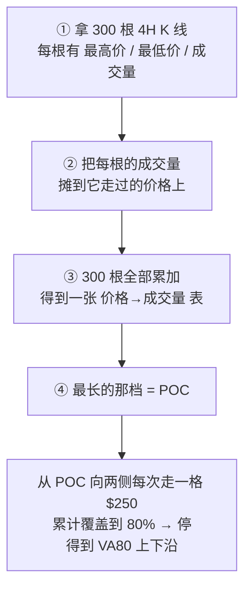

# 第2层 · 价值区 VA80（图解）

**一句话定义**：VA80（Value Area 80%）= 过去一段时间里，**80% 的成交量发生在哪个价格带**。

它回答第2层的问题：**现价在这个价格带里算贵还是便宜。**

> 本文所有数字的快照：**2026-09-14 20:20（UTC+8），现价 $77,909（约 ¥56.1 万）**。
> 数据：OKX BTC-USDT 4H × 300 根（其中 299 根已收盘，未收盘那根已剔除），约 50 天。
> 换个时点跑脚本数字会变，**图和方法不变**。

---

## 一、先看图：一张图看懂它在说什么

每一行 = 一个 **$1,000 价格档**，柱子长度 = 该档成交量占全窗口的比例。
全窗口成交量合计 263,927 BTC。

```text
$ 82,000 |                                              |  0.1%
$ 81,000 |██████                                        |  1.9%
$ 80,000 |██████████████                                |  4.4%
$ 79,000 |█████████████████████████████████             | 10.5%
$ 78,000 |████████████████████████████████████████████  | 13.9%  << VA80 上沿 $78,750
$ 77,000 |██████████████████████████████████████████████| 14.7%  << 现价 $77,909
$ 76,000 |████████████████████                          |  6.5%
$ 75,000 |████                                          |  1.1%
$ 74,000 |██                                            |  0.7%
$ 73,000 |██                                            |  0.6%
$ 72,000 |█████                                         |  1.7%
$ 71,000 |████                                          |  1.2%
$ 70,000 |██                                            |  0.8%
$ 69,000 |██████                                        |  2.0%
$ 68,000 |█████                                         |  1.7%
$ 67,000 |██                                            |  0.6%
$ 66,000 |█                                             |  0.5%
$ 65,000 |████████████                                  |  4.0%
$ 64,000 |██████████████████████████████████████████████| 14.7%
$ 63,000 |██████████████████████████████████████████████| 14.7%  << POC 成交最密 $63,500
$ 62,000 |███████████                                   |  3.6%  << VA80 下沿 $62,250
```

三个名词：

| 名词 | 含义 |
|---|---|
| **POC**（Point of Control） | 柱子最长的那一档 = 成交最集中的价格 |
| **VA80 上沿 / 下沿** | 从 POC 往两侧扩，累计覆盖到 80% 时停下的边界 |
| 中间瘦的那段 | 价格快速穿过的真空区（本例 $66,000~$76,000 几乎没量） |

一眼能读出的信息：这 50 天市场只在**两个地方堆过货** —— $63,000~$65,000（6 月那段）和 $77,000~$79,000（现在），中间是真空。

---

## 二、这张图是怎么算出来的（四步）



下面把 ② 和 ④ 拆开画。

### 步骤 ② 一根 K 线的成交量怎么摊下去

真实例子：**2026-09-14 16:00（UTC+8）那根 4H**，高 $78,373 / 低 $77,599 / 成交量 856.7 BTC。

它走过了 4 个 $250 的桶，于是 `856.7 ÷ 4 = 214.2`，**每桶 +214.2 BTC**：

```text
  高 $78,373 ┐
  $78,250 ┤ +214.2 BTC   ← 落在桶内
  $78,000 ┤ +214.2 BTC
  $77,750 ┤ +214.2 BTC
  $77,500 ┤ +214.2 BTC   ← 低 $77,599 落在桶内
  低 $77,599 ┘
```

**为什么要摊，而不是全记在收盘价上？** 因为一根 K 线内部的成交分布我们看不到（API 只给总成交量）。
摊平是「不知道细节时最诚实的假设」：价格在 $77,599~$78,373 之间来回成交，把量平摊到这几档，
比谎称「全部成交在 $77,788」更接近真实。

**这一步的代价**：K 线跨得越宽，量被摊得越薄。
极端例子：**2026-08-19 20:00 那根**（高 $69,888 / 低 $64,472 / 7,240 BTC）一次摊进 **23 个桶**，
每桶 +314.8 BTC —— 那一根就把 $64,250~$69,750 整段垫高了（对比上面普通那根只摊 4 桶）。

### 步骤 ③ 300 根累加 → 就是第一节那张直方图

### 步骤 ④ 从 POC 向两侧扩到 80%（最容易误解的一步）

规则：**每次比较左右相邻两格谁量大，就往量大的一侧走一格**；累计覆盖到 80% 停。实测扩展过程：

```text
步数 |  下沿     |  上沿     | 累计覆盖
   0 |   63,500 |   63,500 |   4.6% ▓▓
   1 |   63,500 |   63,750 |   9.0% ▓▓▓▓
   2 |   63,500 |   64,000 |  13.4% ▓▓▓▓▓▓
   5 |   63,250 |   64,500 |  24.0% ▓▓▓▓▓▓▓▓▓▓▓
  10 |   62,750 |   65,250 |  34.8% ▓▓▓▓▓▓▓▓▓▓▓▓▓▓▓▓▓
  20 |   62,250 |   67,250 |  37.6% ▓▓▓▓▓▓▓▓▓▓▓▓▓▓▓▓▓▓
  40 |   62,250 |   72,250 |  44.7% ▓▓▓▓▓▓▓▓▓▓▓▓▓▓▓▓▓▓▓▓▓▓
  60 |   62,250 |   77,250 |  61.9% ▓▓▓▓▓▓▓▓▓▓▓▓▓▓▓▓▓▓▓▓▓▓▓▓▓▓▓▓▓▓
  66 |   62,250 |   78,750 |  83.0% ▓▓▓▓▓▓▓▓▓▓▓▓▓▓▓▓▓▓▓▓▓▓▓▓▓▓▓▓▓▓▓▓▓▓▓▓
```

（最后一格跨过 80% 门槛，所以停在 83.0%）

**这张表里藏着两个反直觉的事实：**

| 现象 | 数字 | 含义 |
|---|---|---|
| **左右极不对称** | 左只扩 **5 格**（$63,500→$62,250），右扩了 **61 格** | 左边再往下就没成交了（到头）；右边界是被「凑够 80%」这个规则一路拽上去的 |
| **上沿 ≠ 墙** | $78,750 | 价格站上 $78,750 不代表那里有支撑，只说明**再往上一档已不在 80% 覆盖带里** |

→ **VA80 上沿之上 = 这 50 天没多少成交在这里发生过。** 那是「没有历史包袱」（涨得动），也是「没有历史支撑」（跌起来快）。

---

## 三、最容易踩的坑：换个窗口，结论反过来

同一个算法，只改「看多少根 K 线」，三个窗口的结果：

```text
价格轴：每字符 $500，从 $62,000 起；[ ] = VA80 上下沿，P = 成交最密处，X = 现价
         |         |         |         |         |
  120根4H: -----------------------------[===P=]-----   $76,750 ~ $79,750
  200根4H: --------------[===============P========]-   $69,250 ~ $81,750
  300根4H: [==P=============================]-------   $62,250 ~ $78,750
   现价:                                X             $77,909
         |         |         |         |         |
         62,000    67,000    72,000    77,000    82,000
```

| 窗口 | VA80 | 宽度 | 现价位置 | POC |
|---|---|---|---|---|
| 120 根 4H（20 天） | $76,750 ~ $79,750 | 3.9% | **38.6%（偏下沿 ✅）** | $78,500 |
| 200 根 4H（33 天） | $69,250 ~ $81,750 | 16.0% | 69.3%（偏上） | $77,250 |
| **300 根 4H（50 天，判断卡口径）** | $62,250 ~ $78,750 | 21.2% | **94.9%（上沿 🔴）** | **$63,500** |

**同一个价格 $77,909：一个说「在价值区偏下、可以看」，一个说「在价值区顶端、别碰」。**

原因在图上一眼可见：

- **300 根窗口**的 POC 停在 **$63,500**（6 月那段），VA80 从那儿长出来，被 $63,000~$65,000 的巨量带整个拉长到 21% 宽 → 现价被算到 94.9%。
- **120 根窗口**的 POC 已经跑到 **$78,500**（当下成交最密的地方），VA80 只有 3.9% 宽 → 现价在 38.6%。

**结论：VA80 不是「一个数」，是「窗口的函数」。**
判断卡里固定用 300 根（口径统一、便于连续对比），但必须和第2层的中期区间、短期区间**一起**看 —— 三个口径互相制衡。

---

## 四、在判断卡里看哪一行

| 看什么 | 在哪 |
|---|---|
| 输出 | 判断卡「第2层 · 位置」表格最后一行 `价值区 VA80` |
| 代码 | `~/trading/scripts/daily_card.py:63` 定义 `value_area()`；`:120` 调用（4H × 300）；`:192` 渲染 |
| 机器读 | `daily_card.py --json` 的 `va` 字段 → `{lo, hi, pos}` |

单独只看这一项：

```bash
python3 ~/trading/scripts/daily_card.py --json | python3 -c "import json,sys;print(json.load(sys.stdin)['va'])"
```

---

## 五、VA80 和第3层「成交量密集区」什么关系

两者用的是**同一张价格→成交量表**，只是切法不同：

| | 价值区 VA80 | 成交量密集区（第3层） |
|---|---|---|
| 切法 | 累计覆盖 **80%** 的**连续价格带** | 单档占比 **>2%** 的「墙」（$1,000 一档） |
| 输出 | 上下沿 + 现价百分位 | 一串具体价位 + 各自占比 |
| 回答的问题 | 现在**贵还是便宜**（位置） | 上方**哪里是阻力**、目标能放哪（目标） |
| 用在 | 第2层：区间百分位 | 第3层：选目标、算 RR |

**关系**：VA80 的边界通常就落在密集区的边缘上（本例上沿 $78,750 就在那根 13.9% 大柱子的右端）。
可以互相印证：若算出的 VA80 上沿落在一条完全没有成交的真空带里，多半说明窗口选得不对。

---

## 六、怎么用（三条规则）

1. **永远不要单独看 VA80 的百分位。** 它必须和中、短期区间一起进第2层的组合判定表。
2. **判「位置好不好」用短窗口（120 根 / 20 天）；判「上方有没有历史包袱」用长窗口（300 根）。**
   长窗口的百分位极高或极低，常常只是历史巨量带的残留，不是当下的信号。
3. **现价在 VA80 上沿以上 = 头顶没有历史成交 → 双向都快。**
   这种情况下止损要给足，`≥1.5 × 日线ATR` 这条红线更没得商量。

---

## 七、局限（看图时一起看）

| 局限 | 说明 |
|---|---|
| **窗口敏感** | 20 天 vs 50 天结论可以完全相反（见第三节） |
| **均摊假设** | 一根 K 线的量在 高~低 之间平均分布；跨得宽的 K 线会被摊薄，且无法得知内部真实分布 |
| **没有时间衰减** | 6 月的成交与今天的成交等权 —— 这正是 POC 会停在 $63,500 的原因 |
| **不分买卖方向** | API 成交量不区分主动买/主动卖，看不出「谁在接货」 |
| **桶宽固定 $250** | 桶宽变化会让边界平移；口径统一即可，但对比其他来源数据时要留意 |

---

## 八、自己复算

```bash
python3 ~/trading/scripts/daily_card.py          # 第2层里就有 VA80 行
python3 ~/trading/scripts/daily_card.py --json   # 机器可读
```

本文数据来源：OKX 公开 API `/market/candles`（BTC-USDT，4H，limit=300，已收盘），
经代理 `socks5h://192.168.71.212:7890` 拉取，快照时间 2026-09-14 20:20（UTC+8）。

---

相关：[[10-交易/README|交易目录说明]] · [[10-交易/方法/第5层_触发与RR|第5层 触发与RR]] · [[10-交易/判断卡/2026-09-14|2026-09-14 判断卡]]
